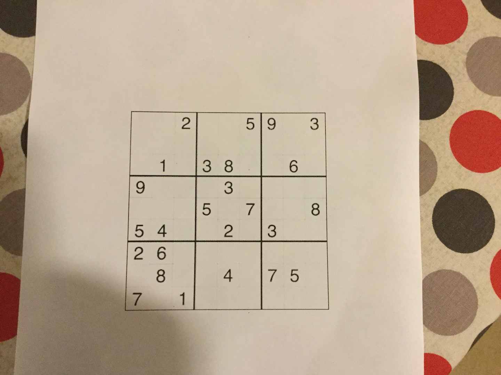
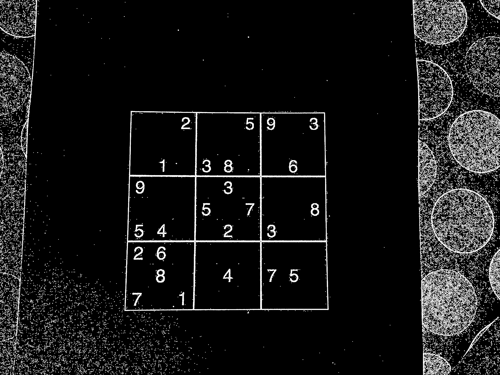
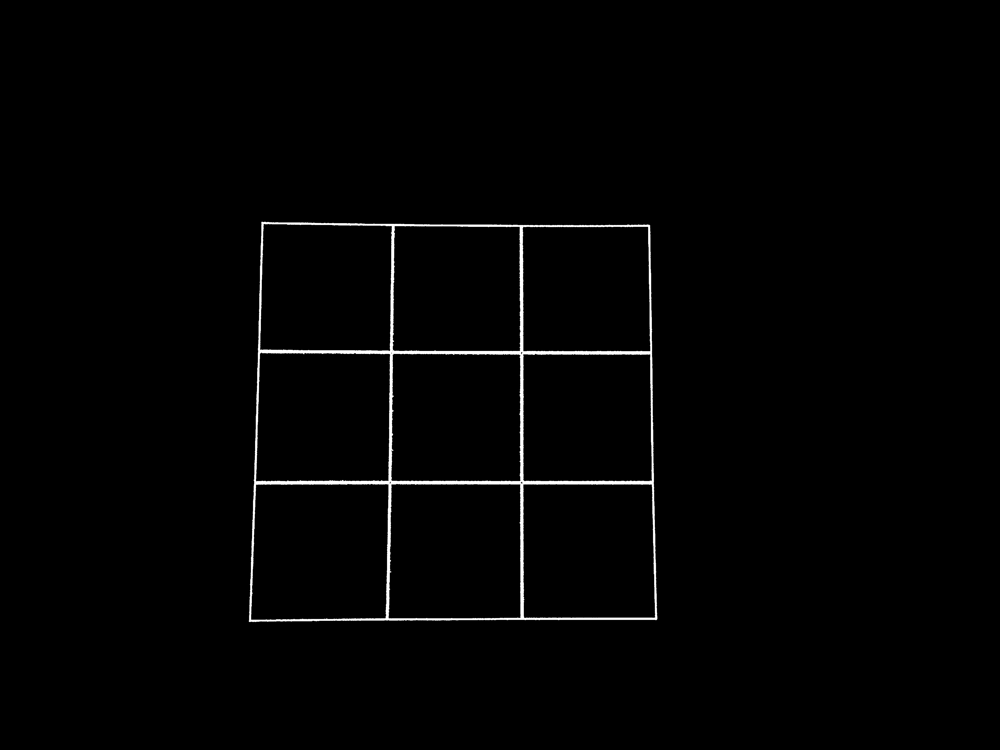
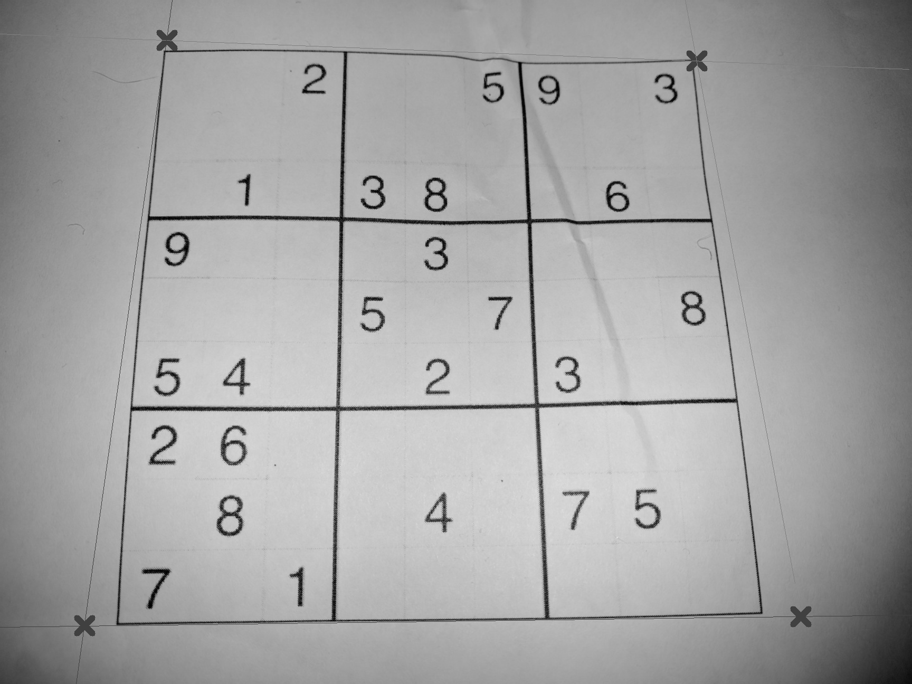
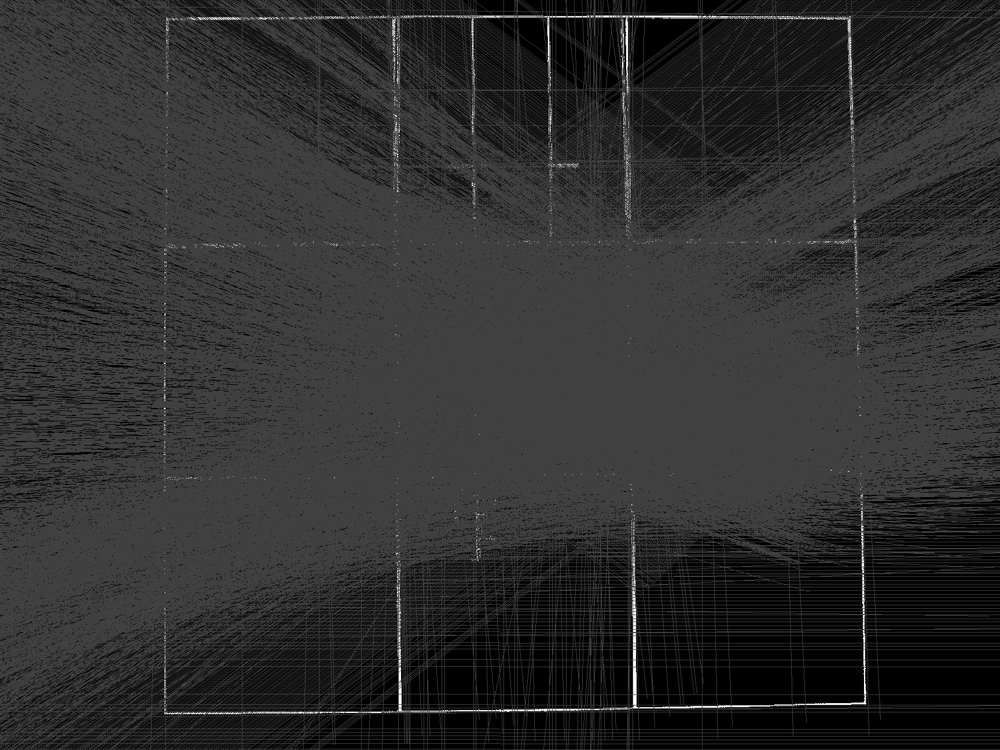
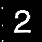
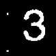
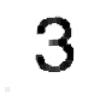

# Sudoku Solver

## How do I install it?

https://play.google.com/store/apps/details?id=uk.co.samuelpratt.sudoku

## What is this?

Sam's free time project to write a simple Android Sudoku solver App.

The idea is that you will be able to take a picture of the puzzle and the App will extract the puzzle
from the image and then solve it.

## It doesn't look polished

Please bear in mind that I'm: -

1. Not an App developer
2. Not a graphic designer

so please don't judge me too much :-) I know this looks a bit rough! The point was for me to have a play with some fun technologies rather than to produce a polished commercial App.

# How does it work?

## Extracting the puzzle from the image

This is by far the hardest part. The two best articles I found on this are: -

* http://aishack.in/tutorials/sudoku-grabber-opencv-detection/
* http://sudokugrab.blogspot.co.uk/2009/07/how-does-it-all-work.html

### Cleaning up the image

This involves: -

* Removing colour
* Thresholding the image to make it binary using an adaptive threshold to deal with shadows and variations in light
* Eroding the image (effectivly expanding lines) to fill in small gaps




### Finding the Grid

#### Algorthm

This involves: -

* Isolating the grid from the rest of the image (I used a simple floodfill agorthm based on the ImageShack article to find the largest connected area in the image)
* Finding edges using a Hough Transform (http://docs.opencv.org/2.4/doc/tutorials/imgproc/imgtrans/hough_lines/hough_lines.html)
* Calculating the corners of the images by : -
  * Finding outer edges (i.e. those nearest to the borders of the image)
  * Calcuating their intersections to find the corners (see http://stackoverflow.com/questions/563198/how-do-you-detect-where-two-line-segments-intersect)





#### Issues that can occur

The two main issues we get are: -

* Sometimes the Hough transform detects the edge of the image. Hence the agorthm will discard any lines running within 1 degree of parallel to the edge of the image within 5px of the edge

* Sometimes the Hough transform detects the diagnoals of the grid as an edge as these go through the corners they tend to get detected as the lowest point in the image. We therefore disguard any lines more than 7 degrees from either Horizontal or Vertical.

Both of these issues can be seen below: -



### Extracting the Puzzle

This involves : -

* A bit more image clean up (I.e. removing the grid that we found so that if some of it gets into the extracted image it
doesn't confuse the OCR algorthm).
* Stretching the image straight using the OpenCV "Warp Perspective" transform.
 * http://docs.opencv.org/3.1.0/da/d6e/tutorial_py_geometric_transformations.html
 * http://stackoverflow.com/questions/17361693/cant-get-opencvs-warpperspective-to-work-on-android


## Parsing the Puzzle

### Getting the digits

To do this you need to chop the puzzle up into 9x9 chunks. As the digits probably
aren't exactly in the right place I've added a border around each area.

The first row is shown below: -

1 
2 
3 
4 
5 
6 
7 
8 
9 

However, as you can see, there are alot of artefacts from bits of the grid and noise that the thresholding didn't remove. These tend to cause issues with the OCR as it thinks some of the larger ones are numbers.

We can help by again removing all but the biggest blob (interconnected area) as this should be the number. If the largest blob is less than a given threshold (currently 1%) of the square it's probably not a number and just an artefact in a blank square so we delete this as well.

The results are shown below: -

1 
2 
3 
4 
5 
6 
7 
8 
9 


### Recognising the digits

This is done using Tess-Two (https://github.com/rmtheis/tess-two). All we do is feed the extracted digits into the parser.

In order to assist recognition we hint Tess-Two and tell it we're only expecting numbers

```java
tessBaseAPI.setVariable("tessedit_char_whitelist", "0123456789");
```

We have to do a little bit of work to convert the OpenCv Mat into a format that Tess-Two understands.

```java
Mat squareMat = getMatForPosition(x, y);

Bitmap squareBmp = Bitmap.createBitmap(squareMat.cols(), squareMat.rows(), Bitmap.Config.ARGB_8888);
Utils.matToBitmap(squareMat, squareBmp);

tessBaseAPI.setImage(squareBmp);
String textFound = tessBaseAPI.getUTF8Text();
```

## Solving the puzzle.

This is pretty easy. You can use a backtracking algorithm which
will effectivly brute force the solution by trying every possible combination
of numbers until it finds a solution that satisfies the constraints. See the
followng links for more information: -

* https://see.stanford.edu/materials/icspacs106b/Lecture11.pdf
* https://en.wikipedia.org/wiki/Sudoku_solving_algorithms

# How to build it

## Environment

You will need: -

* Android Studio
* Android SDK 25 (Nougat)
* The Android Emulator
* OpenCV (see below)
* NDK (see below)
* Tess-Two (see below)


### Installing OpenCV

As I didn't want to check this in you will need to do the following: -

* You will need to install the android version of OpenCV
from http://sourceforge.net/projects/opencvlibrary/files/opencv-android/3.1.0/OpenCV-3.1.0-android-sdk.zip/download: -
 * Use the instuctions from here http://blog.codeonion.com/2015/11/25/creating-a-new-opencv-project-in-android-studio/
 * Open CV should be imported as a module called "openCVLibraryxxx-1" where xxx is the version e.g. openCVLibrary310-1.
 * You will need to add a build.gradle file (see below)
* In order to get the tests in the puzzlescanner module to run you will need to import the OpenCV native binaries into the project
as the unit tests don't use OpenCV manager. To do this: -
 * Copy the contents of OpenCV-android-sdk/sdk/native/libs to Sudoku/puzzlescanner/src/main/jnilibs/
 
```
apply plugin: 'com.android.library'

buildscript {
    repositories {
        mavenCentral()
    }
}

android {
    compileSdkVersion 25
    buildToolsVersion "25.0.1"

    defaultConfig {
        minSdkVersion 16
        targetSdkVersion 25

        versionCode 3100
        versionName "3.1.0"
    }

    sourceSets {
        main {
            manifest.srcFile 'AndroidManifest.xml'
            java.srcDirs = ['src']
            resources.srcDirs = ['src']
            res.srcDirs = ['res']
            aidl.srcDirs = ['src']
        }
    }
}

```
 
### Tess-Two
 
You don't need to do anything to include the library other than add a Mavern reference to it in the build.gradle of the
assembly it's used in i.e. : -

`compile 'com.rmtheis:tess-two:6.1.1'`

However if you want to use this there's a bit of work in getting everything set up correctly as you need to copy the training data to a local directory. I followed the tutorial here http://imperialsoup.com/2016/04/29/simple-ocr-android-app-using-tesseract-tutorial/

The training data is from https://github.com/tesseract-ocr/tessdata. I've only included the english file i.e. https://github.com/tesseract-ocr/tessdata/blob/master/eng.traineddata

# //TODO:

* ~~Work out how to create a basic Android App~~
* ~~Take a picture and show a preview~~
* ~~Get the image from the SD Card (look at https://developer.android.com/training/camera/photobasics.html#TaskPath)~~
* ~~Analyse the image to find the Sudoku grid (See below)~~
* ~~Extract the Puzzle and read the numbers from the Sudoku grid~~
* ~~Solve the puzzle~~
* ~~Wire it all up into a working App~~
* Redesign the take a picture activity as it's currently ugly
* Make it a bit more robust: -
  * Fix the orientation of the Camera
  * Validate the puzzle before we try and solve it
  * ~~Fix the bug where the app crashes when you quit the camera~~
  * ~~Fix the bug when the PuzzleNotFoundException isn't caught properly when the digits are being extracted~~
  * ~~Work out why it's crashing when started from the debugger~~
  * ~~Work out what's going on with the solver: it works from unit tests but returns bad results from the app~~
* ~~Upload the app onto the play store~~
  * ~~Fix the namespace (com.sudoku is taken)~~
  * ~~Generate the required banner and hi-res icons~~
